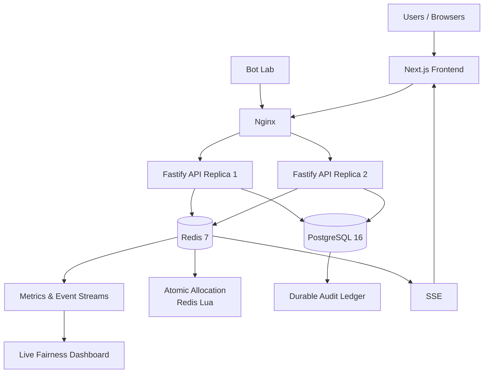

# 🎟️ FairDrop

### Selling 500 seats to 50,000 people — without letting bots win.

FairDrop is a high-concurrency ticket/seat allocation platform designed to make high-demand drops **fair, reliable, and resistant to automated abuse**.

Instead of rewarding whoever clicks fastest, FairDrop uses a **randomized join-window lottery**, verified identities, adaptive anti-abuse mechanisms, atomic allocation, and measurable fairness metrics.

The system is built to simulate a flash crowd of up to **50,000 lightweight clients** competing for **500 seats**, while maintaining allocation integrity and reliable user sessions.

---

## 🚀 The Problem

Traditional high-demand ticket drops often become a race:

> Faster internet + faster bots + more requests = higher chance of getting a seat.

This creates several problems:

* Bots can generate thousands of requests.
* Users with slower connections are disadvantaged.
* Duplicate requests can cause allocation issues.
* Refreshing a page can potentially lose a user's position.
* High traffic can overload the backend.
* It is difficult to prove whether the allocation was actually fair.

### 💡 FairDrop's approach

**Make speed irrelevant. Make identity costly. Keep allocation provably correct.**

Users joining during a defined window are randomized instead of being ranked purely by arrival time. Abuse defenses increase the cost of suspicious activity while atomic inventory management prevents overselling.

---

# ✨ Key Features

### 🎲 Randomized Join-Window Lottery

Users joining during the same window are shuffled using a deterministic, seeded algorithm.

Being **1 ms faster does not automatically mean getting a better position**.

The system uses a seeded Fisher-Yates shuffle to generate final ranks.

---

### ⚛️ Atomic Seat Allocation

FairDrop uses:

* Redis Lua scripts
* PostgreSQL ledger
* Idempotency keys
* TTL-based holds
* Per-user seat limits
* Unique database constraints

The core invariant is:

```text
sold + held + available = total inventory
```

For a 500-seat drop, this must never exceed 500 allocated seats.

---

### 🛡️ Multi-Layer Abuse Protection

The system combines multiple defense layers:

* IP-based rate limiting
* Token-based rate limiting
* Device fingerprint limits
* Subnet limits
* Penalty box
* Request tarpitting
* Risk scoring
* Adaptive proof-of-work
* Nginx request limiting

The defenses can also be switched **ON/OFF during a live demonstration** to compare system behavior.

---

### 🤖 Bot Lab

FairDrop includes a configurable Bot Lab for adversarial testing.

It supports scenarios such as:

1. Baseline humans
2. Naive flooding
3. Distributed botnet
4. Replay/duplicate requests
5. Sybil account creation
6. Slow payment failures
7. Headless human mimic

Each run produces measurable results such as:

* Bot seat share
* Gini coefficient
* Speed Advantage Index
* p95 latency
* Error rate
* Oversell incidents

The Bot Lab is designed to target the local FairDrop instance only.

---

### 📊 Live Fairness Dashboard

The dashboard provides real-time visibility into:

* Seats sold
* Bot seat share
* Gini coefficient
* p95 latency
* 429 rate
* Oversell incidents
* Requests per second
* Human vs bot seat distribution
* Win rate by speed decile
* Join → admission → reservation → payment funnel
* Security events

The dashboard receives live metrics through Server-Sent Events.

---

### 🔐 Adaptive Proof-of-Work

FairDrop can assign different proof-of-work difficulty based on risk tier.

```text
Low Risk     → Lower computational cost
Medium Risk  → Higher computational cost
High Risk    → Highest computational cost
```

The goal is not simply to block suspicious users, but to increase the computational cost of automated abuse.

---

### 🧠 Explainable Risk Scoring

Instead of relying on a black-box ML model, FairDrop uses a transparent rule-based risk scorer.

Signals can include:

* Request frequency
* Burstiness
* Device reuse
* Subnet reuse
* Account age
* Join latency
* Behaviour score
* PoW solve time
* Previous penalty count

The system returns a risk tier along with human-readable reasons.

```json
{
  "score": 82,
  "tier": "high",
  "reasons": [
    "High request burstiness",
    "Device reused across multiple accounts",
    "Repeated rate-limit violations"
  ]
}
```

---

### 🔏 Provable Fairness

FairDrop uses a **commit-reveal mechanism**.

Before the draw:

```text
commitment = SHA256(serverSeed)
```

After the draw, the server reveals the seed.

Anyone can independently verify that:

1. The published commitment matches the revealed seed.
2. The shuffle can be reproduced.
3. The resulting Merkle proof is valid.

This provides a publicly verifiable fairness mechanism.

---

### 🧾 Proof-of-Fairness Receipt

Successful allocations can generate a receipt containing information such as:

* Allocation ID
* Seat count
* Queue batch
* Rank
* Risk tier
* Hashes
* Merkle proof
* Verification information

A public `/verify` page allows users or judges to independently verify the receipt.

---

### 🔄 Reliable Sessions

Refreshing the page should not destroy the user's state.

FairDrop uses:

* `/me/state`
* Server-Sent Events
* `Last-Event-ID`
* Idempotency keys
* Multi-tab synchronization
* Reconnection handling
* Offline/reconnecting states

The server remains the source of truth for the user's current state.

---

### 💥 Chaos Mode

FairDrop includes controlled failure testing such as:

* Killing an API replica
* Restarting Redis
* Slowing PostgreSQL
* Simulating payment outages

The invariant checker continuously verifies that allocation remains consistent during failures.

---

# 🏗️ Architecture



The planned architecture uses Next.js, Fastify, Redis, PostgreSQL, Nginx, and SSE, with two stateless API replicas behind Nginx.

---

# 🧰 Tech Stack

| Layer             | Technology         |
| ----------------- | ------------------ |
| Frontend          | Next.js 14         |
| Language          | TypeScript         |
| Styling           | Tailwind CSS       |
| UI                | shadcn/ui          |
| Animation         | Framer Motion      |
| Charts            | Recharts           |
| Backend           | Node.js 20         |
| API               | Fastify            |
| Validation        | Zod                |
| Hot State         | Redis 7            |
| Atomic Operations | Redis Lua          |
| Database          | PostgreSQL 16      |
| Authentication    | JWT + jose         |
| Realtime          | Server-Sent Events |
| Reverse Proxy     | Nginx              |
| Load Testing      | k6                 |
| Bot Simulation    | Node.js / undici   |
| Infrastructure    | Docker Compose     |

The project is intended to use TypeScript throughout the repository.

---

# 📁 Project Structure

```text
FairDrop/
│
├── apps/
│   ├── web/                 # Next.js frontend
│   └── api/                 # Fastify backend
│
├── packages/
│   └── shared/              # Shared types + Zod schemas
│
├── tools/
│   └── botlab/              # Bot & adversarial testing
│
├── reports/                 # Test run reports
│
├── docker-compose.yml
├── nginx.conf
├── package.json
└── README.md
```

---

# 🔌 API Overview

| Method | Endpoint            | Purpose                           |
| ------ | ------------------- | --------------------------------- |
| POST   | `/auth/register`    | Register user                     |
| POST   | `/auth/verify`      | Verify OTP and create session     |
| GET    | `/me/state`         | Retrieve authoritative user state |
| POST   | `/pow/challenge`    | Create PoW challenge              |
| POST   | `/pow/solve`        | Solve PoW challenge               |
| POST   | `/drop/join`        | Join the drop                     |
| GET    | `/drop/stream`      | Live queue updates                |
| POST   | `/checkout/reserve` | Reserve seats                     |
| POST   | `/checkout/pay`     | Complete mock payment             |
| GET    | `/drop/commitment`  | Retrieve fairness commitment      |
| GET    | `/drop/proof`       | Retrieve fairness proof           |
| GET    | `/receipt/:id`      | Retrieve allocation receipt       |
| GET    | `/metrics/stream`   | Live system metrics               |
| POST   | `/admin/defenses`   | Toggle defenses                   |
| POST   | `/admin/drop/start` | Start a drop                      |
| POST   | `/admin/drop/reset` | Reset a drop                      |
| POST   | `/admin/botlab/run` | Run attack scenario               |
| GET    | `/admin/invariants` | Check allocation invariants       |
| POST   | `/admin/chaos`      | Trigger chaos test                |

The API contract defines these endpoints and shared schemas for frontend/backend integration.

---

# 📈 Fairness Metrics

FairDrop measures fairness instead of simply claiming that the system is fair.

### Bot Seat Share

Percentage of seats won by the simulated bot cohort.

### Gini Coefficient

Measures inequality in seat distribution among participants.

### Speed Advantage Index

Measures the relationship between arrival order and final queue rank.

```text
0    → Speed has little relationship with final rank
-1   → Strong first-come-first-served relationship
```

### Win Rate by Speed Decile

Participants are divided into ten speed groups to determine whether faster clients consistently receive more seats.

### Oversell

Tracks violations of:

```text
sold + held + available = inventory
```

The target is:

```text
Oversell = 0
```

These metrics are part of the project's planned measurable evidence.

---

# 🧪 Testing

FairDrop is designed to test both normal and adversarial traffic.

Example test:

```text
5,000 parallel reservation requests
        ↓
Redis atomic allocation
        ↓
PostgreSQL ledger
        ↓
Invariant checker
        ↓
Expected result:
No overselling
No duplicate allocation
Per-user limits maintained
```

The Bot Lab also generates JSON reports containing scenario parameters, seat distribution, fairness metrics, latency and oversell results.

---

# ⚙️ Getting Started

## 1. Clone the repository

```bash
git clone <YOUR_REPOSITORY_URL>
cd FairDrop
```

## 2. Install dependencies

```bash
npm install
```

## 3. Start the infrastructure

```bash
docker compose up -d
```

> Make sure Docker is installed and running before starting the services.

---

# 🔧 Environment Variables

Create a `.env` file based on your project's environment configuration.

Example:

```env
NODE_ENV=development

DATABASE_URL=your_postgres_url
REDIS_URL=redis://localhost:6379

JWT_SECRET=your_jwt_secret

DEMO_MODE=true
DEFENSES_ENABLED=true
```

Use your actual project environment variables when deploying.

---

# 🖥️ Running the Demo

A typical demo flow is:

```text
1. Start FairDrop
        ↓
2. Register / verify a user
        ↓
3. Join the drop
        ↓
4. Enter randomized waiting room
        ↓
5. Observe live queue position
        ↓
6. Reserve a seat
        ↓
7. Complete mock payment
        ↓
8. Generate fairness receipt
        ↓
9. Verify receipt
```

For the hackathon demonstration:

```text
DEFENSES OFF
      ↓
Run bot attack
      ↓
Observe metrics
      ↓
DEFENSES ON
      ↓
Reset & run same attack
      ↓
Compare results
```

---

# 📊 Benchmark Results

> **Important:** Replace the following placeholders with actual results generated by your Bot Lab/k6 runs. Do not claim target values as measured results.

| Scenario             | Bot Seat Share OFF | Bot Seat Share ON | Speed Index OFF / ON | Oversell |  p95 |
| -------------------- | -----------------: | ----------------: | -------------------: | -------: | ---: |
| Baseline Humans      |               `__` |              `__` |            `__ / __` |      `0` | `__` |
| Naive Flood          |               `__` |              `__` |            `__ / __` |      `0` | `__` |
| Distributed Botnet   |               `__` |              `__` |            `__ / __` |      `0` | `__` |
| Replay Duplicate     |               `__` |              `__` |            `__ / __` |      `0` | `__` |
| Sybil Signup         |               `__` |              `__` |            `__ / __` |      `0` | `__` |
| Slow Payment         |               `__` |              `__` |            `__ / __` |      `0` | `__` |
| Headless Human Mimic |               `__` |              `__` |            `__ / __` |      `0` | `__` |

The project plan explicitly calls for repeated ON/OFF runs and saving the resulting JSON reports.

---

# 🔐 Security & Fairness Design

FairDrop follows several principles:

### Speed should not determine priority

Users inside the join window are randomized.

### More requests should not mean more tickets

Per-user limits, rate limits and idempotency controls prevent request volume from becoming an allocation advantage.

### Suspicious behaviour should increase cost

Risk tiers can trigger higher PoW difficulty and other defenses.

### Allocation must be atomic

Redis Lua handles the critical inventory operations atomically.

### The database provides a durable audit trail

PostgreSQL stores allocation history and uses unique constraints as a second safety layer.

### Fairness should be verifiable

Commit-reveal and Merkle proofs allow allocation results to be independently checked.

---

# ⚠️ Limitations

FairDrop is a hackathon prototype and should not be interpreted as a production-scale ticketing platform without further testing.

Current limitations include:

* Load tests may run on a single laptop.
* Simulated clients are not equivalent to real-world botnets.
* Demo-mode OTP is not real email verification.
* Payment processing is mocked.
* Risk scoring is rule-based rather than ML-based.
* Device/behaviour signals require careful privacy review before production deployment.
* Redis/PostgreSQL deployment would need production-grade clustering, monitoring and disaster recovery.
* Real-world traffic patterns can differ substantially from synthetic tests.

The project plan specifically recommends describing large client counts as **simulated clients** and being honest about single-machine testing limitations.

---

# 🏆 Hackathon Demo

The planned 3-minute demonstration focuses on measurable differences between defenses being disabled and enabled:

```text
0:00  → Introduce the bot problem
0:20  → Normal user joins the drop
0:50  → Turn defenses OFF
        Run bot attack
1:25  → Turn defenses ON
        Run the same attack
2:05  → Trigger chaos test
2:30  → Verify fairness receipt
3:00  → Show measured comparison
```

The demo is designed around a direct comparison of system behaviour rather than only showing a static UI.

---

# 🛣️ Future Improvements

Potential future improvements include:

* Distributed Redis deployment
* Multi-region API infrastructure
* Production payment gateway integration
* Real email/SMS verification
* Advanced behavioural modelling
* More sophisticated bot detection
* Additional independent fairness verification
* Larger distributed load testing
* Production-grade observability
* Privacy-preserving behavioural signals

---

# 👥 Team

### FairDrop — Hackathon Project

Built as a 2-person hackathon project.

**Focus Areas**

* Backend & Systems
* Frontend & User Experience
* Anti-bot infrastructure
* Concurrency
* Fairness measurement
* Adversarial testing

---

# 📜 License

Add your preferred license here, for example:

```text
MIT License
```

---

## ⭐ Why FairDrop?

Most ticket systems try to handle more traffic.

FairDrop focuses on a different question:

> **What if being faster simply shouldn't give you an unfair advantage?**

**Randomize the queue.
Make abuse costly.
Allocate atomically.
Measure everything.
Verify the result.**
